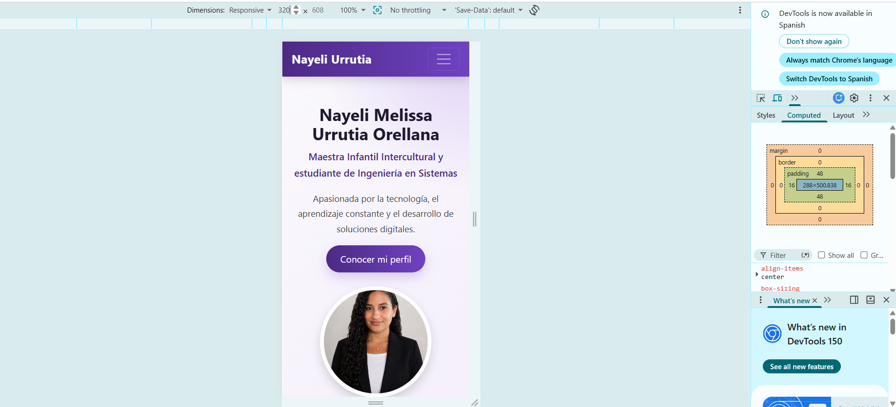
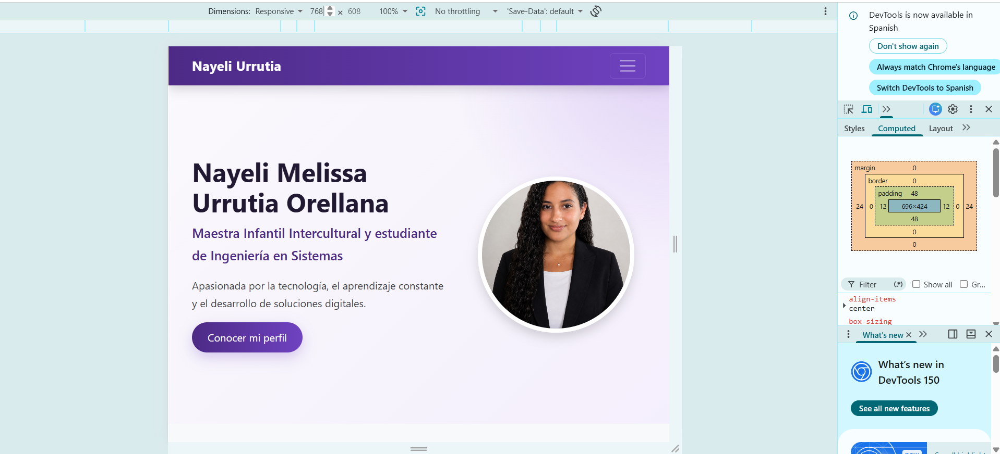
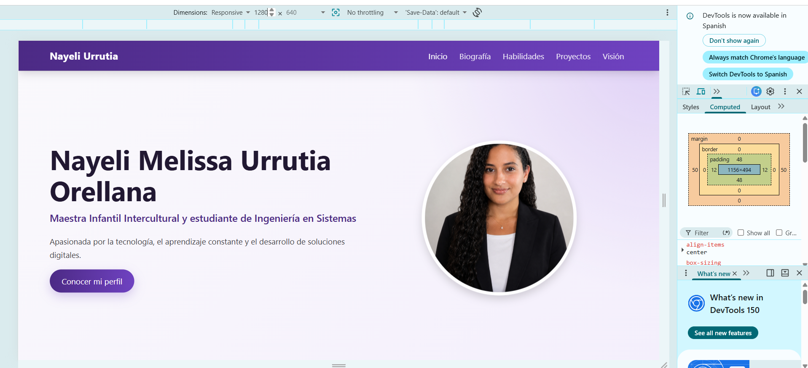

# Portafolio personal con Bootstrap 5

Página web de presentación personal desarrollada como proyecto académico utilizando Bootstrap 5, HTML5 semántico y personalizaciones mediante CSS.

## Autora

**Nayeli Melissa Urrutia Orellana**

Estudiante de Ingeniería en Sistemas de Información y Ciencias de la Computación.

## Objetivo del proyecto

El objetivo de este proyecto es desarrollar una página web de presentación personal que funcione como un portafolio o currículum digital.

La página presenta información sobre mi formación, habilidades, proyectos académicos y visión profesional. También aplica conceptos de diseño responsive, accesibilidad, HTML5 semántico y componentes nativos de Bootstrap 5.

## Tecnologías utilizadas

- HTML5
- CSS3
- Bootstrap 5
- Bootstrap Icons
- Git
- GitHub

## Cómo ejecutar el proyecto

1. Descargar o clonar este repositorio.
2. Abrir la carpeta del proyecto.
3. Localizar el archivo `index.html`.
4. Abrir `index.html` en un navegador web como Google Chrome.

No es necesario instalar dependencias adicionales, debido a que Bootstrap 5 y Bootstrap Icons están integrados mediante CDN.

## Componentes de Bootstrap utilizados

Durante el desarrollo se utilizaron los siguientes componentes y utilidades de Bootstrap:

- Navbar responsive.
- Cards.
- Buttons.
- Badges.
- Rounded Pills.
- List Group.
- Sistema Grid.
- Contenedores y columnas responsive.
- Utilidades de espaciado, sombras, alineación y tipografía.

## Personalización mediante CSS

El archivo `css/style.css` contiene las personalizaciones del proyecto.

Se modificaron los siguientes elementos:

- Paleta de colores en tonos morados.
- Tipografía y tamaños de texto.
- Fondos con degradados.
- Sombras en fotografías y tarjetas.
- Bordes redondeados.
- Efectos al pasar el cursor.
- Animaciones de entrada.
- Animación del ícono de visión profesional.
- Estilos personalizados para el Navbar y el Footer.
- Adaptación para teléfonos, tabletas y computadoras.

No se utilizó `!important`.

## Decisiones de diseño

Se eligió una paleta de colores morados para crear una identidad visual profesional y moderna.

El encabezado utiliza el sistema Grid de Bootstrap para distribuir el texto y la fotografía. En dispositivos móviles, los elementos se presentan en una sola columna.

Las habilidades se organizaron mediante tarjetas, listas y etiquetas. Los proyectos académicos se presentaron con Cards para mantener una estructura uniforme y visual.

También se incorporaron atributos de accesibilidad, textos alternativos para las imágenes y etiquetas para los enlaces e íconos.

## Diseño responsive

La página fue revisada en los siguientes tamaños:

- 320 px para teléfonos pequeños.
- 768 px para tabletas.
- 1280 px para computadoras.

La estructura se adapta sin generar desplazamiento horizontal.

## Capturas del proyecto

### Vista de 320 px



### Vista de 768 px



### Vista de 1280 px



## Estructura del proyecto

```text
portafolio-personal-bootstrap
├── capturas
│   ├── captura-320.png
│   ├── captura-768.png
│   └── captura-1280.png
├── css
│   └── style.css
├── img
│   ├── foto-perfil.jpg
│   ├── proyecto-compiladores.png
│   ├── proyecto-conexiones-red.png
│   └── proyecto-ruta-escolar.png
├── .gitignore
├── index.html
└── README.md